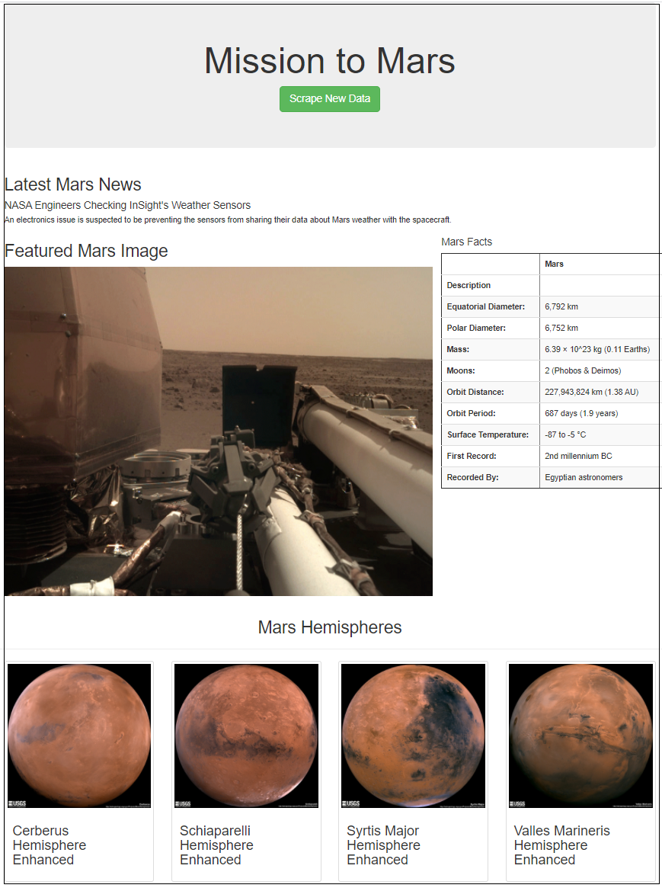

# Mission to Mars

## Project Overview

Robin is a junior data scientist, she also does freelance astronomy work in her spare time. Her dream is to land a position with ***NASA*** someday. So she spends a lot of time visiting sites with news about space exploration, especially the mission to Mars. One day, while reading an article about how much water the red planet may have had in its youth, she has an idea - what it she could write a script that would gather all the information she searches for into one convenient location, and once she gathered it, what if she could show it off to other Astrofiles. If it's polished enough, it may even get NASA's attention. After thinking about it for a day or two, Robin convinces herself. She wants to gather data about the mission to Mars from all over the web and display it in a central location without spending her free time gathering the data maunally. Instead, she plans to build a web application that will scrape new data every time she tells it to, with the click of a button. 

## Purpose of this Assignment

In the past some days, Robin and I worked together and created a web app that could scrape and return the **Latest Mars News**, **Featured Mars Image** and **Mars Facts** - dynamically and on a click of a button.

Robin's web app is looking good and functioning well, but she wants to add more polish to it. She had been admiring images of Mars’s hemispheres online and realized that the site is scraping-friendly. She would like to adjust the current web app to include all four of the hemisphere images. To do this, you’ll use BeautifulSoup and Splinter to scrape full-resolution images of Mars’s hemispheres and the titles of those images, store the scraped data on a Mongo database, use a web application to display the data, and alter the design of the web app to accommodate these images.

## Assignment Results

### Deliverable 1

**Image 1 (below): Hemisphere URLs and Titles as a Python list of dictionaries**


### Deliverable 2

**Image 2 (below): Flask site with the images of Mars Hemispheres**


### Deliverable 3a

**Image 3 (below): Flask site changed to a responsive one**


### Deliverable 3b

Added two Bootstrap 3 components
1. Styled the "Scrape New Data" button - changed the color to `green`
    ``` 
    <p><a class="btn btn-success btn-lg" href="/scrape" role="button">Scrape New Data</a></p>
    ```

2. Changed the Hemisphere display matrix from 2x2 to 1x4 so all hemisphere are in one row
    ```
    <div class="col-md-3">
    ```

**Image 4 (below): Flask site with Bootstrap changes**

